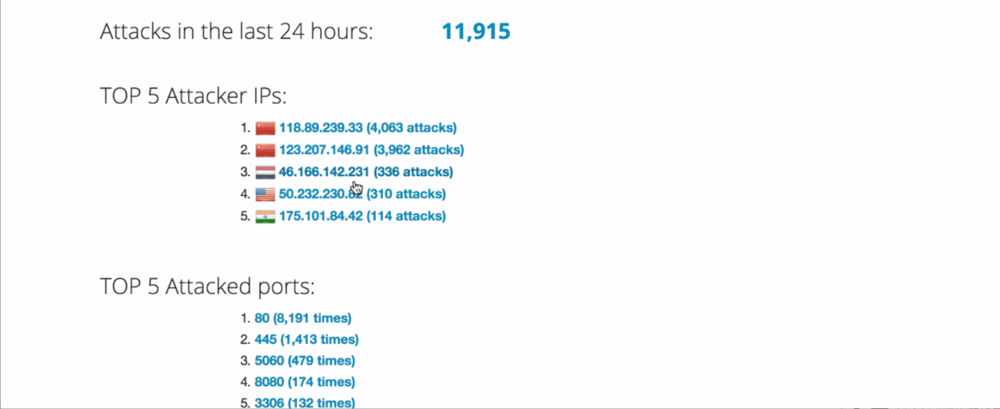

# Web-Security-Week-10
This is the Week 10 and Week 11 assignment write up for the Web Security course by CodePath.

# Project 9 - Honeypot
Time spent: **18** hours spent in total

>Objective: In this assignment, you will stand up a basic honeypot and demonstrate its effectiveness at detecting and/or collecting data about an attack.

- [ ] Which Honeypot(s) you deployed: 
1) Dionaea with HTTP
2) Amun
3) Snort

# Any issues you encountered
The hardest part of this entire lab is setting up the honeypots in GCP. Took up most of the time...

# Attack Summary
number of attacks: 11,915

# Top 5 Attacker IPs:

118.89.239.33 (4,063 attacks)
123.207.146.91 (3,962 attacks)
209.141.35.236 (365 attacks)
46.166.142.231 (336 attacks)
50.232.230.82 (310 attacks)

# Top 5 Attacked Ports:

80 (8,191 times)
445 (1,413 times)
5060 (479 times)
8080 (174 times)
3306 (132 times)

# Any unresolved questions raised by the data collected
None as of right now.

# Malware Collected
None
